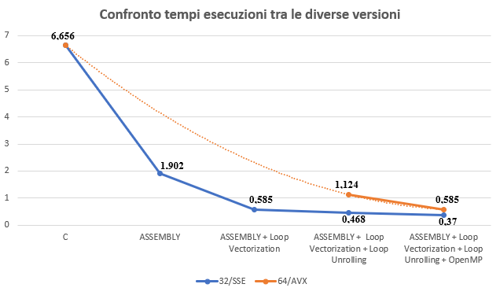

# Fish School Search Algorithm Optimization with Assembly 🐟📈🐟

[](https://en.wikipedia.org/wiki/C_(programming_language))
[](https://en.wikipedia.org/wiki/Assembly_language)
[](https://www.openmp.org/)
[]()
[](https://en.wikipedia.org/wiki/X86-64)

## 🚀 Overview

This repository contains the project for the **Architetture e Programmazione dei Sistemi di Elaborazione** exam of the Master's degree in Computer Engineering at the **University of Calabria**, completed in **January 2022**. The project demonstrates the integration of software and hardware optimization techniques to achieve high-performance computation in solving optimization problems.
For a detailed explanation of the project, refer to the **project outline**,  **project report** and **project presentation** in the `docs/` folder.

---

## 🎯 Project Objective

The primary objective of this project is to implement and optimize the **Fish School Search (FSS)** algorithm, a bio-inspired optimization technique, to find the minimum of a function without requiring gradient information. The focus is on achieving high performance by leveraging software and hardware optimizations.  

### Specific Goals:
💻 **Algorithm Implementation in C**:  
   - Develop a modular and correct implementation of the FSS algorithm in the C programming language.  
   - Ensure the algorithm adheres to the given pseudocode, including its key components: individual, instinctive, and volitive movements.  

⚙️ **Hardware Optimization with Assembly**:  
   - Rewrite performance-critical functions in assembly for two architectures:  
     - **x86-32 with SSE extensions**.  
     - **x86-64 with AVX extensions**.  
   - Exploit hardware-level parallelism and vectorization to improve computational efficiency.  

🏗️ **Parallelization with OpenMP**:  
   - Use OpenMP to parallelize key parts of the algorithm, enabling efficient execution on multi-core processors.  

📊 **Performance Evaluation**:  
   - Compare the performance of different implementations:  
     - Pure C implementation.  
     - C + Assembly (SSE/AVX).  
     - C + OpenMP.  
   - Highlight speedup and computational improvements achieved through the optimizations.  

This project demonstrates a hands-on approach to solving optimization problems while integrating advanced programming techniques for maximizing hardware capabilities.

---

## 🗂️ Repository Structure

- **`data/`**  
  Contains input data files required for running the algorithm.  
  - `coeff32_8.ds2`, `coeff64_8.ds2`: Coefficient vectors for 32-bit and 64-bit implementations.  
  - `rand32_8_64_250.ds2`, `rand64_8_64_250.ds2`: Pre-generated random numbers for 32-bit and 64-bit implementations.  
  - `x32_8_64.ds2`, `x64_8_64.ds2`: Initial fish positions for 32-bit and 64-bit implementations.  
  - `sol32_8_64_250.ds2`, `sol64_8_64_250.ds2`: Expected solutions for 32-bit and 64-bit implementations.

- **`docs/`**  
  Contains project documentation, including the project report and presentation and additional reference materials.

- **`progetti/`**  
  Contains the source code and compiled binaries for the **Fish School Search** algorithm:
  - **`progetti/1/`**: The specific group directory, containing:
    - `fss32c`, `fss64c`: C implementations for 32-bit and 64-bit architectures.
    - `fss32.nasm`, `fss64.nasm`: Assembly implementations for 32-bit (SSE) and 64-bit (AVX).
    - `fss32omp.nasm`, `fss64omp.nasm`: Assembly implementations with OpenMP optimizations.
    - `fss32comp`, `fss64comp`: Compiled C versions with OpenMP optimizations.

- **`utils/`**  
  Python utility scripts for generating and validating data:
  - `fss_data.py`: Generates input data for testing the algorithm.
  - `fss_sol.py`: Validates the results against expected outputs.

- **`test_one`**  
  Script for testing the correctness of the algorithm implementations. Requires all necessary files to be present in the **`progetti/1/`** directory.

- **Compilation Scripts**  
  Scripts for compiling different versions of the algorithm:
  - `compile32`, `compile64`: Compile C implementations for 32-bit and 64-bit architectures.
  - `compile32omp`, `compile64omp`: Compile C implementations with OpenMP for 32-bit and 64-bit architectures.
  - `compile_all`: Compiles all implementations.

- **Execution Scripts**  
  Scripts for running the algorithm:
  - `runfss32`, `runfss64`: Run 32-bit and 64-bit versions of the algorithm.
  - `runfss32omp`, `runfss64omp`: Run OpenMP-optimized versions.

- **Utility Scripts**  
  - `clear_all`: Cleans up generated files, logs, and temporary data.

### 🔍 Notes
- Ensure that all required files are correctly placed in their respective directories before running the scripts.
- Refer to the **Running the Project** section for detailed execution instructions.

---

## 🛠️ Implementation Details

The **Fish School Search (FSS)** algorithm was implemented and optimized following the project requirements, using a combination of **C**, **x86 Assembly (SSE/AVX)**, and **OpenMP**. Below is an explanation of the main components and steps of the implementation:

### 📜 Key Phases of the Algorithm:
1. **🐟 Individual Movement**:  
   - Each fish moves randomly within the search space, adjusting its position according to a local step (`step_ind`).  
   - If the new position improves the objective function (`f`), it is kept; otherwise, the fish reverts to its previous position.  

2. **🌊 Instinctive Movement**:  
   - Fish with higher improvements in the objective function influence others.  
   - Fish are attracted towards these better-performing areas, as described by the instinctive movement formula.  

3. **🌀 Volitive Movement**:  
   - The school contracts towards the barycenter if the total weight of the fish increases (exploitation).  
   - Conversely, if the weight decreases, the school expands to explore new regions (exploration).  
   - This phase is controlled by the volitive step (`step_vol`) and dynamically balances exploration and exploitation.

### 🔧 Optimization Techniques:
1. **SIMD-Based Optimization**:  
   - **Loop Vectorization**: Exploited SSE and AVX registers to perform operations on multiple data points simultaneously, reducing the number of instructions required per loop iteration.  

2. **ILP-Based Optimization**:  
   - **Loop Unrolling**: Reduced overhead by minimizing conditional checks and jump instructions within loops, allowing the processor to execute independent operations in parallel.  

3. **Cache-Based Optimization** *(Excluded)*:  
   - While **Loop Blocking** was considered to improve cache usage by processing smaller chunks of data, it was not implemented as tests showed no significant improvements for the FSS algorithm.  

4. **MIMD-Based Optimization**:  
   - OpenMP was used to distribute loop iterations across multiple threads, achieving substantial speedup on multi-core processors.  

### 🚀 Implementation Workflow:
1. **Baseline Implementation in C**:  
   - Ensured correctness and modularity.  
   - Established the foundation for performance comparisons.  

2. **Assembly Optimizations**:  
   - Implemented in stages:  
     - Basic conversion from C to Assembly.  
     - Added **SIMD optimizations** with SSE/AVX.  
     - Introduced **Loop Unrolling** for further improvements.  

3. **Parallelization**:  
   - Applied OpenMP directives to critical loops in both 32-bit and 64-bit implementations.  

This structured approach allowed for iterative enhancements, demonstrating the impact of hardware-level optimizations and parallelism on the Fish School Search algorithm.

---

## 🚀 Running the Project

This section provides detailed instructions for running the Fish School Search (FSS) algorithm across different architectures and optimization configurations. The implementation supports **x86-32 with SSE**, **x86-64 with AVX**, and **OpenMP** optimizations.

### 📋 Prerequisites
- **Operating System**: Linux (e.g., Ubuntu)
- **Compiler**:  
  - `gcc` for compiling the C code  
  - `nasm` for assembling the assembly code  
- **Python** (optional): For generating data and analyzing results using helper scripts (`fss_data.py`, `fss_sol.py`).

### 🏗️ Compiling the Code
Use the provided scripts to compile the project for different configurations:

1. **Compile the 32-bit Implementation (C + SSE)**:
   ```bash
   ./compile32
   ```
2. **Compile the 64-bit Implementation (C + AVX)**:
   ```bash
   ./compile64
   ```
3. **Compile all versions**:
   ```bash
   ./compile_all
   ```
4. **Compile OpenMP versions**:
  * 32-bit with OpenMP: 
    ```bash
    ./compile32omp
    ```
  * 64-bit with OpenMP: 
    ```bash
    ./compile64omp
    ```

### 🏃 Running the Algorithm

Run the compiled versions using the provided scripts. Replace `<arch>` with the desired architecture (`32`, `64`, `32omp`, `64omp`).

1. **Baic Execution**:
   ```bash
   ./runfss<arch>
   ```
2. **Custom Parameters**: Use the following structure to specify parameters:
   ```bash
   ./fss_<arch> -c <c> -r <r> -x <x> -np <np> -si <stepind> -sv <stepvol> -w <wscale> -it <itmax>
   ```
    * `<arch>`: Architecture (`32c`, `64c`, `32ompc`, `64ompc`)
    * `<c>`: Path to the `.ds2` file containing the coefficient vector.
    * `<r>`: Path to the `.ds2` file with random numbers.
    * `<x>`: Path to the `.ds2` file with initial fish positions.
    * `<np>`: Number of fish.
    * `<stepind>`: Initial individual step.
    * `<stepvol>`: Initial volitive step.
    * `<wscale>`: Initial weight.
    * `<itmax>`: Number of iterations.

### 🧪 Testing the Implementations

To verify the correctness of the algorithm, you can use the script **`test_one`**. Ensure that all the required files are correctly placed before running the test:

1. The **`progetti/id_group`** directory must contain all necessary source files:
   - **C files**: Both the high-level C implementations (`fss32c.c`, `fss64c.c`, `fss32comp.c`, `fss64comp.c`) and any other helper C files.  
   - **NASM files**: The assembly implementations (`fss32.nasm`, `fss64.nasm`, `fss32omp.nasm`, `fss64omp.nasm`).  
2. Compilation scripts and input data (`coefficients`, `random numbers`, `initial positions`) must also be present and correctly configured.

#### 📈 Testing

Run the provided test scripts to verify correctness:
   ```bash
   ./test_one
   ```

#### 🛠️ Debugging and Logs

* **Debugging Tools**: Use the `evaluate32` and `evaluate64` scripts for detailed evaluation and debugging of the respective versions.
* **Clear Temporary Files**: Use the `clear_all` script to clean up logs and temporary files:
   ```bash
   ./clear_all
   ```

---

## 🏆 Results

The performance of the Fish School Search (FSS) algorithm was evaluated across different implementations to assess the impact of hardware and software optimizations. Below is a summary of the results and insights:  

### Results Summary:
1. **C to Assembly Translation**:  
   - The most significant reduction in execution time was achieved by translating high-level C code into low-level assembly, exploiting hardware-specific instructions.  

2. **SIMD Optimization**:  
   - Implementing **SIMD-based optimizations** (e.g., Loop Vectorization using SSE/AVX) resulted in a **75% reduction** in execution time.  

3. **ILP Optimization**:  
   - Applying **Instruction-Level Parallelism (ILP)** techniques, such as Loop Unrolling, further reduced execution time by approximately **20%**.  

4. **MIMD Optimization**:  
   - Using **MIMD-based parallelism** with OpenMP added another **20-25% reduction**, demonstrating the benefits of multi-threading on multi-core processors.  

### Performance Chart:
Below is a representation of execution time for two architectures evaluated:  
  - **32-bit with SSE**: Represented by the blue line in the graph.  
  - **64-bit with AVX**: Represented by the orange line.  

Both architectures showed a clear trend of **decreasing execution time** with each additional optimization step. The x-axis shows the levels of optimizations applied, while the y-axis represents the corresponding execution times. This evaluation demonstrates that optimizations such as **SIMD**, **ILP**, and **MIMD** significantly enhance the efficiency of the Fish School Search algorithm, making it well-suited for high-performance computation. 

<p align="center">
    
</p>

### Observations:
**⏱️ Execution Time Sensitivity**: Since execution times were generally less than 1 second, results were highly dependent on the system's current state. For more precise measurements, larger datasets or a greater number of iterations would be required.  

---

## 🧑‍🤝‍🧑 Collaboration

This project was developed in collaboration with [fradeluca](https://github.com/fradeluca) and [SimoneA27](https://github.com/SimoneA27). Thank you for the support and teamwork! 🙌

---